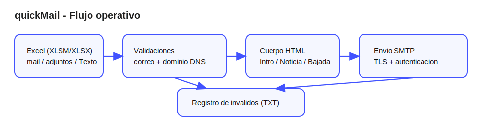

# quickMail

[](https://github.com/SoulOppen/mailer/actions/workflows/ci.yml)


Automatiza envios de correo personalizados a partir de un archivo Excel, aplicando validaciones de email y dominio antes del envio SMTP.

## Flujo del sistema



## Caracteristicas

- Lee destinatarios y contenido desde un workbook de Excel.
- Construye un cuerpo HTML usando bloques de texto configurables.
- Valida formato de correo y resolucion DNS de dominio.
- Guarda correos/dominios invalidos en archivos TXT para auditoria.
- Ejecuta pruebas automaticamente con GitHub Actions.

## Estructura

- `main.py`: orquestacion del flujo completo.
- `condition.py`: validadores de email y dominio.
- `read_and_write.py`: utilidades de lectura/escritura TXT.
- `constants.py`: constantes centralizadas del proyecto.
- `tests/`: pruebas para todas las funciones.
- `.github/workflows/ci.yml`: pipeline CI.
- `AGENT.md`: reglas de calidad y orquestacion de skills/subagentes.
- `skills/`: base para skills reutilizables.

## Requisitos

- Python 3.11 o superior.
- Cuenta SMTP con credenciales validas.
- Archivo Excel con estas hojas/columnas:
  - Hoja `mail`, columna `mail`.
  - Hoja `adjuntos`, columna `subject`.
  - Hoja `Texto`, columnas `Intro`, `Noticia`, `Bajada`.

## Instalacion

```bash
python -m venv .venv
# Linux/macOS
source .venv/bin/activate
# Windows PowerShell
.\\.venv\\Scripts\\Activate.ps1
pip install -r requirements.txt -r requirements-dev.txt
```

## Configuracion

1. Copia `.env.example` a `.env`.
2. Completa las variables:

```env
SMTP_SERVER=smtp.tu-proveedor.com
SMTP_PORT=587
SMTP_USER=tu_mail@dominio.com
SMTP_PASSWORD=tu_app_password
```

3. Ajusta la ruta del Excel si corresponde:
   - por defecto se usa `data/Prototipo.xlsm` (ver `constants.py`).

## Ejecucion

```bash
python main.py
```

## Testing local

```bash
pytest --cov=. --cov-report=term-missing --cov-fail-under=80
```

## CI en GitHub

El workflow `CI` corre en cada `push` y `pull_request` a `main/master`:

- instala dependencias,
- ejecuta tests con cobertura,
- falla si la cobertura baja de 80%.

## Buenas practicas del proyecto

- Gestion de tareas con mas de un TODO por ticket (minimo 2).
- Tests obligatorios para todas las funciones.
- Constantes en `constants.py`.
- Funciones explicitas y documentadas con docstrings.